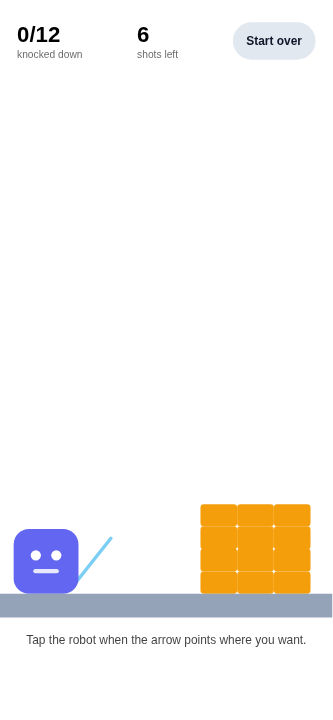

# Block Toss

Tap the robot to launch a ball at the tower. Knock all 12 blocks down before
you run out of shots. The aim line swings up and down on its own — tap when
it's pointing where you want.

Built end-to-end with the `mobile-app-builder` skill (v1.5.0) as its first
real test, including the visual validation loop.



## Run it

```bash
npm install
npx expo start
```

Then scan the QR code with the Expo Go app on your phone.

## How it's put together

- `src/game/engine.ts` — the physics, as plain TypeScript with no React and no
  react-native imports. Gravity, the ball, block-on-block contact, and the
  rule for when a block counts as knocked down all live here, so the game can
  be simulated and checked without rendering anything.
- `src/components/block-toss.tsx` — draws the world and runs one animation
  loop that advances both the physics and the swinging aim from the same
  clock, so the aim line points exactly where the next shot will go.
- `src/app/index.tsx` — the screen.

Blocks collide as upright boxes even while drawn rotated. Proper rotated-box
collision is a lot more code and, at this size and speed, a player can't tell
the difference.

## Two bugs the build caught

Worth recording, because both were invisible to the type checker:

1. **The tower fell over on its own.** Stacked blocks touch exactly, so
   floating-point noise made their overlap flicker just above zero every
   frame. Contact resolution kept nudging and spinning them, and the game
   opened claiming 11 of 12 blocks were already down. Fixed with a 0.5px
   contact tolerance, and by only imparting spin on a real shove.
2. **The "Start over" button was 73×28px** — under the 44×44 minimum for a
   reliable thumb tap. Caught by the layout check, not by eye.
